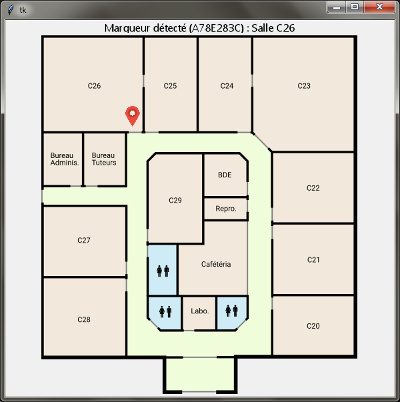

# projet_scientifique
Communication avec la base de données : 

Le programme récupère les informations transmises depuis le port série par la carte Arduino, et recherche une correspondance dans la base de données SQLite embarquée. 

## Prérequis
* Python 3
* pyserial (`pip install pyserial`)

## Usage
Le script **db_param.py** initialise la base de données, il est à exécuter une seule fois avant de démarrer le programme. Il créera le fichier data.db.

Le script **main.py** ouvre la fenêtre et tente de se connecter au lecteur RFID. Une fois connecté, il affichera la position de l'utilisateur sur la carte.
